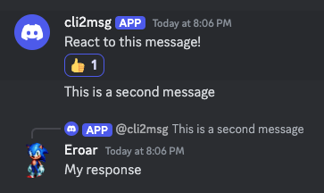
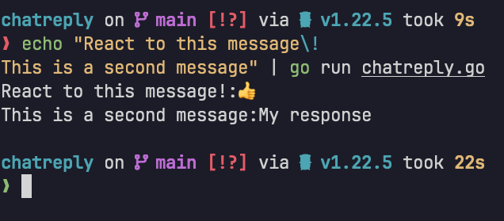

# ChatReply

## Example usage

Run the command and pipe input into its _stdin_

_Tip: By default the messages are splitted by newline character_  
_(In the example the '\\' is used to escape '!' symbol)_
```bash
echo "React to this message\!
 This is a second message" | go run chatreply.go
```

Bot starts to watching for reaction on the messages (indicated by the eyes emoji)


Upon reacting to a message the eyes emoji dissapears  
_Tip: Both emoji reactions and text responses are supported_



And original messages including the replies are outputed to _stdout_ in real time (once the program sees the reply)



## Configuration
### From .dotfiles
You need to specify the providers and their configuration in
`$XDG_CONFIG_HOME/chatreply/conf.toml`

The toml fields and syntax:

```toml
ActiveProviders = ["discord"]

[Discord]
UserID = "<YOUR-USER-ID>"
Token = "<YOUR-TOKEN>"
```

### Specify path
You can also specify the path of the .toml config file as an argument
```shell
go run chatreply.go -f "./config-file.toml"
```
